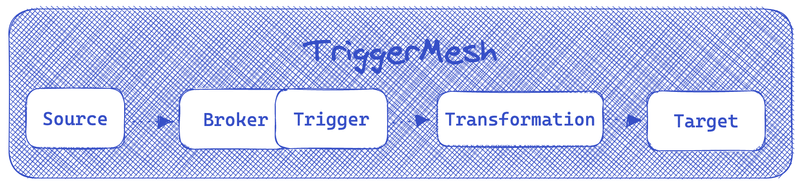
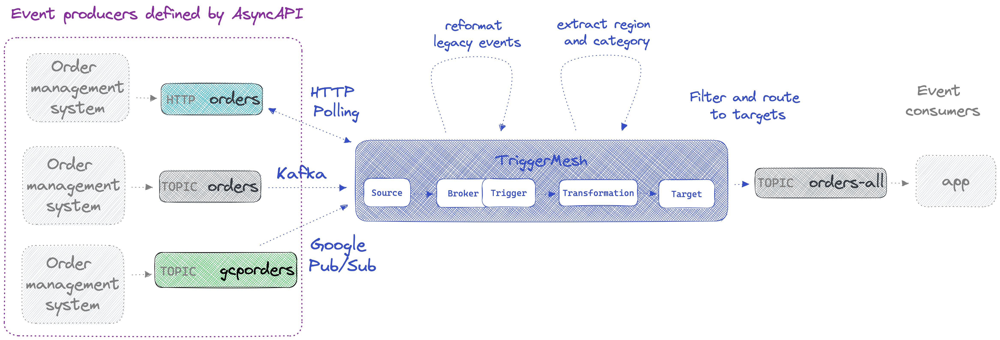

# AsyncAPI, say hi to TriggerMesh

This tutorial demonstrates how to use AsyncAPI with TriggerMesh. It shows how the two play nicely together because TriggerMesh can ingest, transform, filter, and route events from channels defined in an AsyncAPI definition. This is one of many possible ways to use the two technologies together.

The scenario is based on the perspective of a DevOps engineer that has been provided with an AsyncAPI definition that describes an application (or set of applications) that produce `order` events over various channels including a **Kafka topic**, a **Google pub/sub topic**, and an **HTTP service**.  The engineer's task is to ingest `orders` from these different channels and route them to a single downstream **Kafka topic** called `unified-orders`.

The tutorial leverages the TriggerMesh open-source command-line interface called `tmctl` to create the TriggerMesh **sources**, **brokers**, **triggers** and **targets** that make up the event flow. `tmctl` lets you run these components locally on any laptop that has Docker.



The project includes a [prototype parser](parser.js) built with AsyncAPI's [js-parser](https://github.com/asyncapi/parser-js). It parses the provided AsyncAPI definition and generates `tmctl` CLI commands that create TriggerMesh event sources that will ingest events from the various channels into a TriggerMesh broker for further processing. You could of course write the `tmctl` commands manually too, but this parser shows how nicely a well-documented AsyncAPI definition can be used alongside TriggerMesh.

The following schema illustrates what we'll build in this tutorial.



Please reach out to the TriggerMesh team on [Slack](https://join.slack.com/t/triggermesh-community/shared_invite/zt-1kngevosm-MY7kqn9h6bT08hWh8PeltA) or [GitHub](https://github.com/triggermesh/tutorials/issues/new) if you need help getting this to work or have any feedback.

## Prerequisites

### `tmctl`

Install `tmctl` with homebrew or [other methods](https://docs.triggermesh.io/get-started/quickstart/):

```sh
brew install triggermesh/cli/tmctl

```

### AsyncAPI's `js-parser`

We also need to install the AsyncAPI parser. Make sure you have a recent enough version of npm and node:

```sh
npm install @asyncapi/parser
```

### Quickstart a Kafka cluster

One of the order management systems is producing `orders` on a Kafka topic called `orders`. We also want to write all unified orders to a downstream `unified-orders` topic. We'll need a cluster to implement these topics.

Here we provide an easy way to start one using RedPanda and Docker Compose, but you could use any Kafka distribution you like (self-hosted or managed).

The provided docker-compose file will start a single node RedPanda cluster and a handy console. It is configured to work with docker desktop and could require some adjustments to the listeners and advertised listeners for it to work on other environments. Reach out to us on Slack or GitHub if you need help, or see [here](https://www.confluent.io/blog/kafka-listeners-explained/) if you want to deep dive on this.

```sh
docker-compose up -d
```

### Start a mock HTTP service

We'll start a mock HTTP service locally to simulate the order management system that provides `orders` through an HTTP API. In a new terminal, and at the root of this repo so it can access the [order.json](order.json) file that contains a mock event (requires python 2 or 3):

```sh
python3 -m http.server 8000
```

### (Optional) AsyncAPI CLI

You don't necessarily need it, but the [AsyncAPI CLI](https://github.com/asyncapi/cli) is a great companion for working with AsyncAPI definitions during development, particularly the Studio that you can easily run in your browser to view or edit the [provided AsyncAPI definition](asyncapi.yaml).

```sh
brew install asyncapi
asyncapi start studio &
```

## Overview of the AsyncAPI definition

### Servers

Lets take a look at what we've got in our [AsyncAPI definition](asyncapi.yaml). We've defined three servers that represent the three order management systems. These definitions contain information that we'll need to create the TriggerMesh source components that will read from these servers.

```yaml
servers:
  kafkaserver:
    url: host.docker.internal:9092
    protocol: kafka
  httpserver:
    url: http://host.docker.internal:8000
    protocol: http
  googlepubsub:
    url: https://cloud.google.com
    protocol: googlepubsub
```

### Channels

The next


Open a new terminal and start `watch` to watch events flowing through the broker:

```sh
tmctl watch
```

## Ingest and transform orders from Kafka

Now we can send in an order and watch it land in broker. Do do this you can open the RedPanda console that was started in the docker compose and should be available at http://localhost:8080/ by default.

Go to the orders topic and publish this:

```json
{
  "orderid": 18,
  "ordertime": 1497014222380,
  "region": "eu",
  "category": "fashion",
  "item": {
    "itemid": "184",
    "brand": "Patagonia",
    "category": "Kids",
    "name": "Tribbles Hoody"
	}
}
```

You should see it show up in the terminal that is running `tmctl watch`.

## Add a new HTTP poller source of orders

The next order management system whose events we need to integrate provides and HTTP API that we need to regularly poll for new events.

First we'll start a mock HTTP service locally to simulate this service, in a new terminal. Start it at the root of this repo so it can access the right mock json events:

```sh
python3 -m http.server 8000
```

Now we create the HTTP Poller:

```sh
tmctl create source httppoller --name orders-httppoller --method GET --endpoint http://host.docker.internal:8000/mock-events/legacy_event.json --interval 10s --eventType orders-legacy
```

You can adjust the endpoint depending on your environment. I’m using host.docker.internal because I’m running on Docker Desktop.

## Pub/Sub

tmctl create source googlecloudpubsub --name orders-gcp-pubsubsource --topic projects/jmcx-asyncapi/topics/ordersgcp --serviceAccountKey $(cat serviceaccountkey.json)
