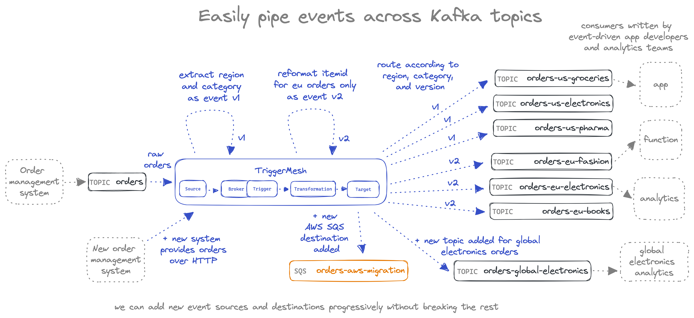

# Kafka pipes tutorial

This tutorial shows how to easily create pipes across Kafka topics by using TriggerMesh. The running example is based on customer orders coming from an order management system for an ecommerce website. The raw orders land in a Kafka topic called `orders`, from which we'll transform, filter and route events towards Kafka topics destined towards specific consumers, which each have their own requirements in terms of which events they want to see, and how they're formatted.

The tutorial achieves this by leveraging `tmctl`, TriggerMesh's new command line interface, to create a broker, sources, triggers, transformations and targets.

We start by creating the flow from a single `orders` source topic towards six different destination topics, each with their own filtered set of events. Then we show how we can easily extend the system by adding new producers of raw orders over HTTP, as well as new targets such as AWS SQS and a new Kafka topic.



## Setup Kafka and TriggerMesh

The provided docker-compose file will start a single node RedPanda cluster. It is configured to work with docker desktop and could require some adjustments to the listeners and advertised listeners for it to work in other contexts. See [here](https://www.confluent.io/blog/kafka-listeners-explained/) if you want to deep dive on this.

```sh
docker-compose up -d
```

Create a TriggerMesh broker ([install TriggerMesh's tmctl](https://docs.triggermesh.io/get-started/quickstart/) command line interface first):

```sh
tmctl create broker triggermesh
```

Open a new terminal and start `watch` to watch events flowing through the broker:

```sh
tmctl watch
```

## Ingest and transform orders from Kafka

Create the main Kafka source that will ingest the raw orders. You'll first need to edit the bootstrap servers config value according to your environment, here it is configured for using docker desktop.

```sh
tmctl create source kafka --name orders-source --topic orders --bootstrapServers $(cat config/bootstrap.servers.txt) --groupID mygroup
```

Now we can send in an order and watch it land in broker. Do do this you can open the RedPanda console that was started in the docker compose and should be available at http://localhost:8080/ by default.

Go to the orders topic and publish this:

```json
{
  "orderid": 18,
  "ordertime": 1497014222380,
  "region": "eu",
  "category": "fashion",
	"item": {
    "itemid": "184",
		"brand": "Patagonia",
    "category": "Kids",
		"name": "Tribbles Hoody"
	}
}
```

You should see it show up in the terminal that is running `tmctl watch`:

```sh
~/TriggerMesh % tmctl watch
2023/01/16 15:29:45 triggermesh | Connecting to broker
2023/01/16 15:29:50 triggermesh | Watching...
☁️  cloudevents.Event
Context Attributes,
  specversion: 1.0
  type: io.triggermesh.kafka.event
  source: orders
  subject: kafka/event
  id: 4d9d4b8f-b7a5-4419-927e-0cbf4431f01b
  time: 2023-01-16T14:30:54.986275756Z
  datacontenttype: application/json
Data,
  {
    "orderid": 18,
    "ordertime": 1497014222380,
    "region": "eu",
    "category": "fashion",
    "item": {
      "itemid": "184",
      "brand": "Patagonia",
      "category": "Kids",
      "name": "Tribbles Hoody"
    }
  }
```

Next we'll transform these raw events by changing the `type` of the event from `io.triggermesh.kafka.event` (as you can see in the `watch` output above) to `$region-$category-v1`, in which `$region` and `$category` are variables that we'll extract from the event payload. We'll add the `v1` suffix so that we can make additional transformations down the road and bump the version at each stage. This will let certain consumers continue to work with `v1` while others move to `v2` and so forth. The changes will be performed by a single transformation, that you can find in the file [orders-add-region-category.yaml](transformations/orders-add-region-category.yaml), which contains the following JSON transformation (see [JSON transformation documentation](https://docs.triggermesh.io/transformation/jsontransformation/) for details):

```yaml
context:
- operation: add
  paths:
  - key: type
    value: $region-$category-v1
data:
- operation: store
  paths:
  - key: $region
    value: region
  - key: $category
    value: category
```

The `store` operation extracts the region and category from the event payload (hence the `data` section of the code), and the `add` operation adds it to the type metadata field (hence the `context` section of the code).

Lets create a new transformation component by passing it this JSON transformation code, and then we'll create a trigger that routes all the events coming from the original `orders` Kafka topic to that transformation by filtering on event type `io.triggermesh.kafka.event`:

```sh
tmctl create transformation --name transform-extract-region-category -f transformations/orders-add-region-category.yaml
tmctl create trigger --eventTypes io.triggermesh.kafka.event --target transform-extract-region-category
```

If we send the same event into the `orders` topic again and then look at the output of `watch`, we can now see the original event followed by the transformed event coming in with its `type` now set to `eu-fashion-v1` (only showing the transformed event below):

```json
☁️  cloudevents.Event
Context Attributes,
  specversion: 1.0
  type: eu-fashion-v1
  source: orders
  subject: kafka/event
  id: e6961b5b-a6b6-402d-a712-1c6916c647ef
  time: 2023-01-16T14:33:48.250547169Z
  datacontenttype: application/json
Data,
  {
    "orderid": 18,
    "ordertime": 1497014222380,
    "region": "eu",
    "category": "fashion",
    "item": {
      "itemid": "184",
      "brand": "Patagonia",
      "category": "Kids",
      "name": "Tribbles Hoody"
    }
  }
```

## Routing to the right topics

Now we can use this newly structured event type to help with routing events to the right destination topics. We'll start by creating all the necessary Kafka target components that will write to the respective topics:

```sh
tmctl create target kafka --name orders-us-groceries-target --topic orders-us-groceries --bootstrapServers $(cat config/bootstrap.servers.txt)
tmctl create target kafka --name orders-us-electronics-target --topic orders-us-electronics --bootstrapServers $(cat config/bootstrap.servers.txt)
tmctl create target kafka --name orders-us-pharma-target --topic orders-us-pharma --bootstrapServers $(cat config/bootstrap.servers.txt)
tmctl create target kafka --name orders-eu-fashion-target --topic orders-eu-fashion --bootstrapServers $(cat config/bootstrap.servers.txt)
tmctl create target kafka --name orders-eu-electronics-target --topic orders-eu-electronics --bootstrapServers $(cat config/bootstrap.servers.txt)
tmctl create target kafka --name orders-eu-books-target --topic orders-eu-books --bootstrapServers $(cat config/bootstrap.servers.txt)
```

Now we can create the triggers that will subscribe these targets to filtered sets of events. We using filters such as `--eventTypes eu-fashion-v1` to say that this specific trigger should only fire for events of that type. You can also list multiple eventTypes if you want (comma separated).

```
tmctl create trigger --name us-groceries --eventTypes us-groceries-v1 --target orders-us-groceries-target
tmctl create trigger --name us-electronics --eventTypes us-electronics-v1 --target orders-us-electronics-target
tmctl create trigger --name us-pharma --eventTypes us-pharma-v1 --target orders-us-pharma-target
tmctl create trigger --name eu-fashion --eventTypes eu-fashion-v1 --target orders-eu-fashion-target
tmctl create trigger --name eu-electronics --eventTypes eu-electronics-v1 --target orders-eu-electronics-target
tmctl create trigger --name eu-books --eventTypes eu-books-v1 --target orders-eu-books-target
```

Now sending the same test order as previously will result in a new event in the `eu-fashion` topic.

## Testing with more mock events

You can play around with combinations of values for `region` and `category` to make sure the events get routed to the correct destination topics.

But if you want to try sending a larger number of events, here is a quick solution to do that. It requires that you download and unzip Apache Kafka (e.g.)[here](https://kafka.apache.org/quickstart)), because I'm using its included Kafka Producer script.

We'll set the `KAFKA_HOME` env var to the location of the unzipped Kafka archive, e.g. `KAFKA_HOME=~/TriggerMesh/tm-projects/kafka_2.13-3.3.1`.

Then we can run:

```sh
$KAFKA_HOME/bin/kafka-console-producer.sh --broker-list localhost:9093 --topic orders < mock-events/100_generated_mock_events.json
```

## The EU region is asking for a different format

Lets now imagine that the EU team want `itemid` formatted differently, so we need do a transform just on the `eu` events, and version these events as `v2`. The two changes will be performed by a single transformation, that you can find in the file [orders-eu-format.yaml](transformations/orders_eu_format.yaml). The benefit here is that some consumers can continue consuming `v1` if they want, while others can move to `v2`, thereby minimising the chances of breaking existing consumers and de-risking this change.

```sh
tmctl create transformation --name transform-eu-format -f transformations/orders-eu-format.yaml
tmctl create trigger --eventTypes eu-fashion-v1,eu-electronics-v1,eu-books-v1 --target transform-eu-format
```

We also need to update the triggers to send `v2` events to the `eu` topics. Note that `create` commands will update the existing triggers when they already exist.

```sh
tmctl create trigger --name eu-fashion --eventTypes eu-fashion-v2 --target orders-eu-fashion-target
tmctl create trigger --name eu-electronics --eventTypes eu-electronics-v2 --target orders-eu-electronics-target
tmctl create trigger --name eu-books --eventTypes eu-books-v2 --target orders-eu-books-target
```

Now we should see EU topics getting the transformed version of the itemID, test it out!

## Adding a new target topic on the fly

We're asked to create a new topic for all electronics orders, irrespective of region, for a new analytics team. We can easily do this by creating a new Kafka target for that topic, and routing the events needed with a new trigger. Notice that here we're passing multiple event types to the trigger so that it can fire for all electronics orders across the EU and US:

```sh
tmctl create target kafka --name orders-global-electronics-target --topic orders-global-electronics --bootstrapServers $(cat config/bootstrap.servers.txt)
tmctl create trigger --eventTypes eu-electronics-v2,us-electronics-v1 --target orders-global-electronics-target
```

## Running on K8s

Try `tmctl dump` and you'll see the K8s manifest for this event flow as an output. If you [install TriggerMesh on K8s](https://docs.triggermesh.io/installation/kubernetes-yaml/) then you can directly pipe the output of this command into `kubectl` and have you event flow running on any Kubernetes cluster 🤩. 
