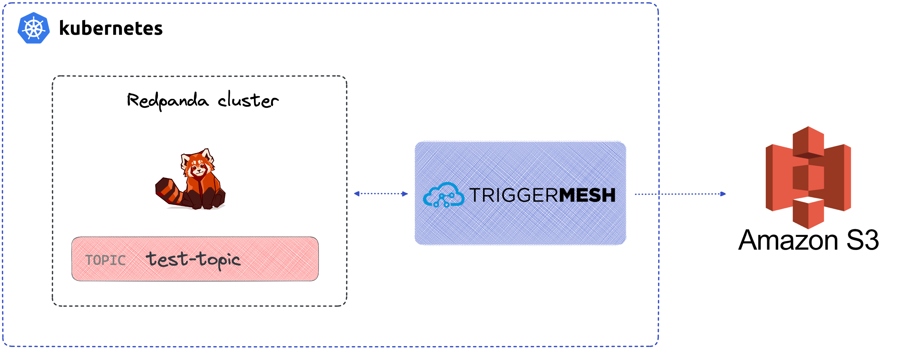

# Kubernetes-native connectivity for Redpanda with TriggerMesh, tutorial for AWS S3



## Introduction

Redpanda is a modern Kafka-API compatible data streaming platform, and if you’ve centred your workload orchestration around Kubernetes then you might be inclined to also deploy Redpanda to Kubernetes. Luckily the Redpanda team have you covered and they provide a lot of guidance to help you do this. But if you want an easy way to connect data sources and sinks to Redpanda on Kubernetes the solution might not be as obvious.

Kafka Connect could seem like an obvious choice for data sources and sinks but it was not designed as a Kubernetes-native solution and therefore is not very idiomatic to Kubernetes. There is some interesting reading available [such as this](https://www.morling.dev/blog/ideation-kubernetes-native-kafka-connect/) [and this](https://redpanda.com/blog/kafka-kubernetes-deployment-pros-cons) that discuss some of the challenges of running Kafka Connect on K8s. An alternative to Kafka Connect in this scenario is TriggerMesh, that was built from the ground up to run natively on Kubernetes. It does this by providing Kubernetes controllers and Custom Resource Definitions which means to can define source and sinks just like you would any other native Kubernetes object.

In this post we’ll learn the basics of TriggerMesh and discuss how it can be used to get data into and out of Redpanda on Kubernetes. Once both Redpanda and TriggerMesh are installed on Kubernetes, we’ll use the TriggerMesh CLI called tmctl to easily create the K8s manifest for the TriggerMesh connectors.

## Setting up Redpanda on K8s

Use Helm to spin up a multi-node Redpanda cluster.

```
helm repo add redpanda https://charts.redpanda.com/
helm repo update
helm install redpanda redpanda/redpanda \
    --namespace redpanda \
    --create-namespace
```

It will take a few seconds for the cluster creation. Use this command to track the progress:

```sh
kubectl -n redpanda rollout status statefulset redpanda --watch

#output
Waiting for 3 pods to be ready...
Waiting for 2 pods to be ready...
Waiting for 1 pods to be ready...
statefulset rolling update complete 3 pods at revision redpanda-76d98b7647...
```

## Setting up TriggerMesh on K8s

TriggerMesh relies on Knative Serving to run some of its components as Knative Services. We plan to relax this dependency in the near future. While we recommend following the official installation instructions, the remainder of this section serves as a quick guide for installing the Knative components.

Begin by installing the Knative Operator:

```sh
kubectl apply -f https://github.com/knative/operator/releases/download/knative-v1.8.1/operator.yaml -n default
```

Check the status of the Operator by running the command:

```sh
kubectl get deployment knative-operator -n default
```

Now install the Knative Serving component with the Kourier Networking layer:

```yaml
kubectl apply -f - <<EOF
apiVersion: v1
kind: Namespace
metadata:
  name: knative-serving
---
apiVersion: operator.knative.dev/v1beta1
kind: KnativeServing
metadata:
  name: knative-serving
  namespace: knative-serving
spec:
  ingress:
    kourier:
      enabled: true
  config:
    network:
      ingress-class: "kourier.ingress.networking.knative.dev"
EOF
```

Check the status of Knative Serving Custom Resource using the command (can take a minute before it displays as ready):

```sh
kubectl get KnativeServing knative-serving -n knative-serving
```

Finally configure Knative Serving to use Magic DNS (sslip.io) with:

```sh
kubectl apply -f https://github.com/knative/serving/releases/download/knative-v1.8.3/serving-default-domain.yaml
```

Refer to the official documentation if you want to use a real DNS instead.

This concludes the installation of Knative Serving.

Install the TriggerMesh Helm chart
Add the TriggerMesh chart repository to Helm:

```sh
helm repo add triggermesh https://storage.googleapis.com/triggermesh-charts
```

To install the chart with the release name triggermesh:

```sh
helm install -n triggermesh triggermesh triggermesh/triggermesh --create-namespace
```

The command deploys the TriggerMesh open-source components and uses the default configuration that can be adapted depending on your needs.

## Push events to Amazon S3

First setup an Amazon S3 bucket that we'll use as an event target.

You can follow the instructions at [Create your first S3 bucket](https://docs.aws.amazon.com/AmazonS3/latest/userguide/creating-bucket.html).

You'll need the queue's `ARN` and AWS credentials as part of the TriggerMesh command to create the AWS S3 target.

Secret

```yaml
apiVersion: v1
kind: Secret
metadata:
  name: aws
type: Opaque
stringData:
  AWS_ACCESS_KEY_ID: "<AWS Access Key ID>"
  AWS_SECRET_ACCESS_KEY: "<AWS Secret Access Key>"
```

Target

```yaml
apiVersion: targets.triggermesh.io/v1alpha1
kind: AWSS3Target
metadata:
  name: aws-s3-target
spec:
  arn: arn:aws:s3:::bucket
  auth:
    credentials:
      accessKeyID:
        valueFromSecret:
          name: aws
          key: AWS_ACCESS_KEY_ID
      secretAccessKey:
        valueFromSecret:
          name: aws
          key: AWS_SECRET_ACCESS_KEY
```

## Read events from Redpanda

```yaml
apiVersion: sources.triggermesh.io/v1alpha1
kind: KafkaSource
metadata:
  name: sample
spec:
  groupID: test-consumer-group
  bootstrapServers:
    - kafka.example.com:9092
  topic: test-topic
  sink:
    ref:
      apiVersion: targets.triggermesh.io/v1alpha1
      kind: AWSS3Target
      name: aws-s3-target
```

## TriggerMesh is a K8s-native alternative to Kafka Connect

Reproducing a similar example to this one but using Kafka Connect will raise a few questions and pain points:
* Installing Kafka Connect on K8s is not as streamlined as the Helm or YAML approaches supported by TriggerMesh
* Each individual Kafka Connect connector needs to be downloaded and installed manually, whereas TriggerMesh provides them as CRDs
* Configuring the Kafka Connect connectors is done with old-fashioned config files, whereas TriggerMesh is configured with YAML manifests like any other Kubernetes resource
* TriggerMesh connectors can be scaled and restarted by K8s if needed
