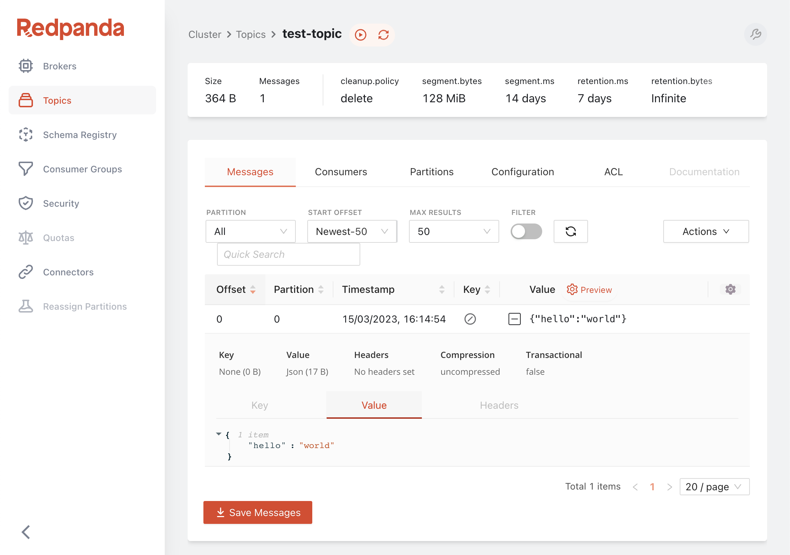
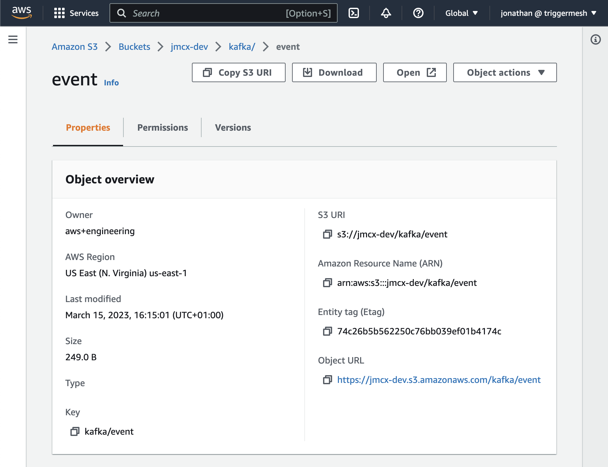

# Kubernetes-native connectivity for Redpanda with TriggerMesh, example with AWS S3

## Introduction

Redpanda is easy to run on Kubernetes thanks to the availability of Helm charts and [plenty of guidance and documentation](https://docs.redpanda.com/docs/deploy/deployment-option/self-hosted/kubernetes/) to help you do this. But we have a hunch that some Redpanda users are missing a Kubernetes-native way to connect data sources and sinks to Redpanda. Kafka Connect predates containerisation technology and is not very idiomatic to Kubernetes. There is some interesting reading available such as [here](https://www.morling.dev/blog/ideation-kubernetes-native-kafka-connect/) and [here](https://redpanda.com/blog/kafka-kubernetes-deployment-pros-cons) that discuss some of the challenges of running Kafka Connect on K8s. 

An alternative to Kafka Connect in this scenario is [TriggerMesh](https://triggermesh.com/) which was built from the ground up to run natively on Kubernetes. It does this by providing Kubernetes controllers and Custom Resource Definitions which can be used to describe and deploy sources and sinks for Redpanda just like you would any other native Kubernetes object. TriggerMesh's Kafka connectors are among its most popular, meaning it is well suited to act as a Kafka consumer or producer. And it can [connect to many other systems](https://www.triggermesh.com/connectors) that you might want to use as sources or sinks for Redpanda, such as Google Cloud Storage, Azure Storage, AWS SQS, HTTP APIs, MongoDB, and much more. 

In this post we’ll go into a specific example of using TriggerMesh to stream data from a Redpanda topic into an AWS S3 bucket, with everything running the Kubernetes-native way. 


## Setting up a local Kind K8s cluster

You can use any K8s distribution, but in this example we'll run Kind locally. 

We'll define the `kind-config.yaml` file as follows:

```yaml
apiVersion: kind.x-k8s.io/v1alpha4
kind: Cluster
nodes:
  - role: control-plane
  - role: worker
  - role: worker
  - role: worker
```

And create a multi-node Kubernetes kind cluster:

```sh
kind create cluster --config kind-config.yaml

kubectl get nodes

#output
NAME                 STATUS   ROLES           AGE   VERSION
kind-control-plane   Ready    control-plane   36s   v1.25.3
kind-worker          Ready    <none>          16s   v1.25.3
kind-worker2         Ready    <none>          16s   v1.25.3
kind-worker3         Ready    <none>          16s   v1.25.3
```

## Setting up Redpanda on K8s

It is easy to spin up a multi-node Redpanda cluster by using the provided Helm charts:

```
helm repo add redpanda https://charts.redpanda.com/
helm repo update
helm install redpanda redpanda/redpanda \
    --namespace redpanda \
    --create-namespace
```

It will take a few seconds for the cluster to be created. you can use the following command to track the progress:

```sh
kubectl -n redpanda rollout status statefulset redpanda --watch

#output
Waiting for 3 pods to be ready...
Waiting for 2 pods to be ready...
Waiting for 1 pods to be ready...
statefulset rolling update complete 3 pods at revision redpanda-76d98b7647...
```

You should see some sample commands in the output, such as checking the API status:

```sh
kubectl -n redpanda exec -ti redpanda-0 -c redpanda -- rpk cluster info --brokers \
redpanda-0.redpanda.redpanda.svc.cluster.local.:9093,\
redpanda-1.redpanda.redpanda.svc.cluster.local.:9093,\
redpanda-2.redpanda.redpanda.svc.cluster.local.:9093
```

Lets create a topic that we'll read from later on with a TriggerMesh source connector:

```sh
kubectl -n redpanda exec -ti redpanda-0 -c redpanda -- rpk topic create test-topic --brokers \
redpanda-0.redpanda.redpanda.svc.cluster.local.:9093,\
redpanda-1.redpanda.redpanda.svc.cluster.local.:9093,\
redpanda-2.redpanda.redpanda.svc.cluster.local.:9093  
```

## Prereq: install Knative Serving

TriggerMesh relies on Knative Serving to run some of its components as Knative Services. In this example, that'll be the AWS S3 target, which will scale automatically, including to 0 when not being used. 

TriggerMesh will relax the dependency on Knative Serving in the near future. In the meantime, here is a quick guide for installing the Knative Serving.

Begin by installing the Knative Operator:

```sh
kubectl apply -f https://github.com/knative/operator/releases/download/knative-v1.8.5/operator.yaml -n default
```

Check the status of the Operator by running the command:

```sh
kubectl get deployment knative-operator -n default
```

Now install the Knative Serving component with the Kourier Networking layer:

```yaml
kubectl apply -f - <<EOF
apiVersion: v1
kind: Namespace
metadata:
  name: knative-serving
---
apiVersion: operator.knative.dev/v1beta1
kind: KnativeServing
metadata:
  name: knative-serving
  namespace: knative-serving
spec:
  ingress:
    kourier:
      enabled: true
  config:
    network:
      ingress-class: "kourier.ingress.networking.knative.dev"
EOF
```

Check the status of Knative Serving Custom Resource using the command (can take a minute before it displays as ready):

```sh
kubectl get KnativeServing knative-serving -n knative-serving
```

Finally configure Knative Serving to use Magic DNS (sslip.io) with:

```sh
kubectl apply -f https://github.com/knative/serving/releases/download/knative-v1.8.5/serving-default-domain.yaml
```

## Install TriggerMesh

Add the TriggerMesh chart repository to Helm:

```sh
helm repo add triggermesh https://storage.googleapis.com/triggermesh-charts
```

To install the chart with the release name triggermesh:

```sh
helm install -n triggermesh triggermesh triggermesh/triggermesh --create-namespace
```

The command deploys the TriggerMesh open-source components and uses the default configuration that can be adapted depending on your needs.

## Push events to Amazon S3

First, make sure to setup an Amazon S3 bucket that we'll use as an event target.

You can follow the instructions at [Create your first S3 bucket](https://docs.aws.amazon.com/AmazonS3/latest/userguide/creating-bucket.html).

You'll need the queue's `ARN` and AWS credentials to authenticate the TriggerMesh AWS Target. Here we're using a user access key, but you can also use an IAM role (see the [AWS S3 Target docs](https://docs.triggermesh.io/1.24/targets/awss3/) for details).

The manifest belows starts with a K8s secret for storing the credentials, and is followed by a CRD for the TriggerMesh AWS S3 Target connector. 

```yaml
apiVersion: v1
kind: Secret
metadata:
  name: aws
type: Opaque
stringData:
  AWS_ACCESS_KEY_ID: "<AWS Access Key ID>"
  AWS_SECRET_ACCESS_KEY: "<AWS Secret Access Key>"

---

apiVersion: targets.triggermesh.io/v1alpha1
kind: AWSS3Target
metadata:
  name: aws-s3-target
spec:
  arn: <S3 bucket ARN>
  auth:
    credentials:
      accessKeyID:
        valueFromSecret:
          name: aws
          key: AWS_ACCESS_KEY_ID
      secretAccessKey:
        valueFromSecret:
          name: aws
          key: AWS_SECRET_ACCESS_KEY
```

You can save this to a file called awsS3target.yaml and then create these resources on your cluster:

```sh
kubectl apply -f awsS3target.yaml
```

## Read events from Redpanda

Now lets create the TriggerMesh Kafka source connector that will read from Redpanda and write directly to the AWS S3 target. What will happen under the hood is that the Kafka source will read from the Redpanda topic, convert the message to a CloudEvent, and send the CloudEvent to the S3 target over HTTP.

This simple architecture is valuable for this demo, but we recommend using a [TriggerMesh broker](https://docs.triggermesh.io/1.24/brokers/redisbroker/) component between the Kafka source and the S3 target for more advanced use cases.

```yaml
apiVersion: sources.triggermesh.io/v1alpha1
kind: KafkaSource
metadata:
  name: kafka-source
spec:
  groupID: test-consumer-group
  bootstrapServers:
    - redpanda-0.redpanda.redpanda.svc.cluster.local:9093
    - redpanda-1.redpanda.redpanda.svc.cluster.local:9093
    - redpanda-2.redpanda.redpanda.svc.cluster.local:9093
  topic: test-topic
  sink:
    ref:
      apiVersion: targets.triggermesh.io/v1alpha1
      kind: AWSS3Target
      name: aws-s3-target
```

Save this to a file such called kakfasource.yaml and create the objects on your cluster:

```sh
kubectl apply -f kafkasource.yaml
```

## Send a message to Redpanda with the Console

I like to use Redpanda Console to interact with topics, send messages, etc... to access it on K8s we'll need to do some port-forwarding. 

```sh
kubectl -n redpanda port-forward svc/redpanda-console 8080:8080
```

You should then be able to open the Redpanda Console at [http://localhost:8080/topics](http://localhost:8080/topics) and send an event with a payload like `{"hello":"world":}`:



Head over to S3 and you should see the object there:



Well done! You are now streaming data from Redpanda to AWS S3 🙂.

## TriggerMesh is a K8s-native way to connect with Redpanda

We just demonstrated how to stream data from Redpanda to AWS S3 with TriggerMesh on Kubernetes. The same process can be used to ingest data into Redpanda, and there are many different sources and sinks to choose from. 

Some of the strengths of this approach are:
* Installing TriggerMesh on K8s is a familiar process to any K8s operator
* TriggerMesh connectors are configuration-driven and are [available as Custom Resource Definitions](https://docs.triggermesh.io/1.24/reference/sources/)
* TriggerMesh connectors will scale automatically with K8s and recover from failure

If you'd like to give TriggerMesh a try, you can head over to [the quickstart guide](https://docs.triggermesh.io/1.24/get-started/quickstart/) or [join the community on Slack](https://join.slack.com/t/triggermesh-community/shared_invite/zt-1kngevosm-MY7kqn9h6bT08hWh8PeltA) and ask questions there, we'd love to hear from you! 
