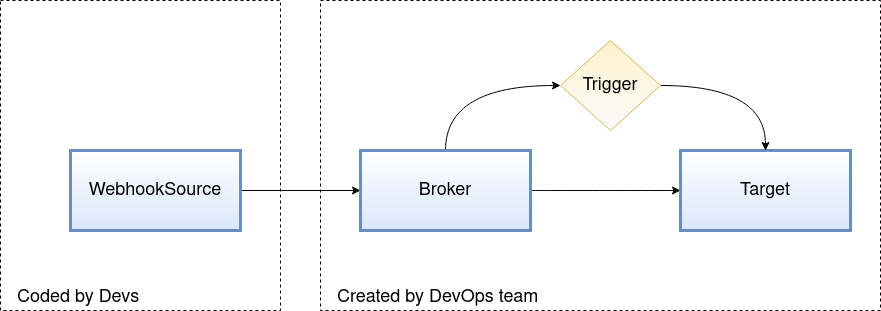

# TriggerMesh with node.js

In this tutorial we are going to programatically create a `WebhookSource` that is able to send events to an HTTP sink.
For demoing purposes we are going to require [TriggerMesh stack](https://docs.triggermesh.io/installation/kubernetes-yaml/) deployed at the Kubernetes cluster. This enable us to use `WebhookSource` and our Brokers.



## DevOps Tasks

Create a namespace for this tutorial:

```console
kubectl create ns tm-nodejs
```

Create a Broker, a target service that consumes events, and a trigger that does the subscription between both:

```console
# Create RedisBroker
kubectl apply -n tm-nodejs -f https://raw.githubusercontent.com/triggermesh/triggermesh-core/main/docs/assets/manifests/getting-started-redis/broker.yaml

# Target service (and DLS for non delivered events)
kubectl apply -n tm-nodejs -f https://raw.githubusercontent.com/triggermesh/triggermesh-core/main/docs/assets/manifests/common/display-target.yaml
kubectl apply -n tm-nodejs -f https://raw.githubusercontent.com/triggermesh/triggermesh-core/main/docs/assets/manifests/common/display-deadlettersink.yaml

# Trigger that binds Target and Broker
kubectl apply -n tm-nodejs -f https://raw.githubusercontent.com/triggermesh/triggermesh-core/main/docs/assets/manifests/getting-started-redis/trigger.yaml
```

## Dev Tasks

Kubernetes CRDs must be downloaded and converted to JSON. This can be easily done using the cluster's CRDs in code, but we chose to provide the [JSON for WebhookSource](components/webhooksource-crd.json) to keep the code at minimum.

The [Webhook resource JSON](components/webhooksource-cr.json) is also provided. You can modify it, but keep in mind that the Trigger created will only let event types `demo.type1` through.

### Code It

>
> **NOTE**
>
> If you are checking out the project from this tutorial skip the `npm` commands that set it up. You only need to install the dependencies using `npm install`
>

Setup your project.

```console
npm init
```

Use [GoDaddy's kubernetes library](https://github.com/godaddy/kubernetes-client). Any other Kubernetes library for `node.js` that can has a dynamic client or supports CRDs could be used.

```console
npm i kubernetes-client --save
```

These are the objects required from the Kubernetes library:

```js
const { Client, KubeConfig } = require('kubernetes-client');
const Request = require('kubernetes-client/backends/request');
```

CRDs are schemas that will validate and make it easy to code Kubernetes objects. These schemas can be retrieved from the live cluster or provided to the application locally, which is what we are doing here. First we load the CRD then the object that will be created (CR), into a variable. Feel free to modify the CR in your own way.

```js
const webhookSourceCRD = require('./components/webhooksource-crd.json');
const webhookSourceCR = require('./components/webhooksource-cr.json');
```

The Kubernetes namespace will be read from the `NAMESPACE` environemnt variable.

```js
const namespace = process.env.NAMESPACE || 'default';
```

The `main` function set up a Kubernetes client using the expected locations at your computer. When running the code inside the cluster the environment variable `NODE_ENV=production` should be set.

```js
        const kubeconfig = new KubeConfig();

        if (process.env.NODE_ENV === 'production') {
            kubeconfig.loadFromCluster();
        } else {
            kubeconfig.loadFromDefault();
        }

        const backend = new Request({ kubeconfig });
        kubeclient = new Client({ backend });
```

The `kubeclient` object can now be used to connect to the cluster, but it knows nothing about TriggerMesh components. We need to inform it about the CRD schemas for the objects we want to manage:

```js
    kubeclient.addCustomResourceDefinition(webhookSourceCRD);
```

Now we just need to use the kubeclient to use the CRD API (identified by its group and version), at the namespace where we want to create the `WebhookSource`.

```js
        const whs = await kubeclient.apis[webhookSourceCRD.spec.group].v1alpha1.namespaces(namespace).webhooksources.post({ body: webhookSourceCR });
        console.log('Created WebhookSource:', whs);
```

You can extend this tutorial:

- Reading the CRD from the live cluster instead of from a local file.
- Parametrizing the `WebhookSource` spec.
- Adding operations to update and delete existing `WebhookSource`.
- Managing other objects like `RedisBroker` or `Trigger`.

### Run It

- If you are running the application from a Kubernetes Pod, also set `NODE_ENV=production`
- If the `node_modules` does not exists, run `npm install`

Run the application pointing to the namespace where the `RedisBroker` is running.

```console
NAMESPACE=tm-nodejs node main.js
```

After issuing the command a new webhook should be ready to ingest events from your applications.

```console
kubewclt get webhooksource -n tm-nodejs ws-with-node
NAME           READY   REASON   URL                                                                 SINK                                                AGE
ws-with-node   True             https://webhooksource-ws-with-node-tm-nodejs.piper.triggermesh.io   http://demo-rb-broker.tm-nodejs.svc.cluster.local   78s
```

### Clean Up

The easiest way to clean up would be.

```console
kubectl delete webhooksources.sources.triggermesh.io -n tm-nodejs ws-with-node
```

But we would suggest extending the code remove it programatically. It is as simple as slightly modifying one line at the provided code!

```js
        const whs = await kubeclient.apis[webhookSourceCRD.spec.group].v1alpha1.namespaces(namespace).webhooksources('ws-with-node').delete();
```
