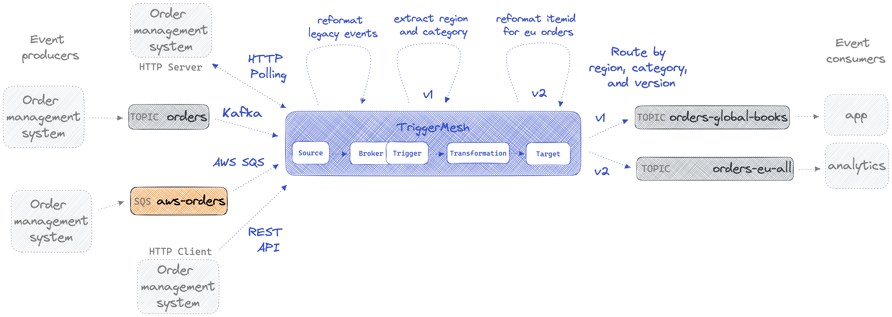

# Use tmctl to unify events from heterogeneous sources

This tutorial demonstrates how to use TriggerMesh to capture orders from heterogenous sources and transform, filter and route them in a unified way. It leverages the TriggerMesh command-line interface called `tmctl`. The following schema depicts what we'll build throughout the tutorial.



Reach out on Slack or GitHub if you need help getting it to run on a different platform.

## Setup TriggerMesh

Install tmctl by [following the documentation](https://docs.triggermesh.io/get-started/quickstart/). You can use homebrew or other methods:

```sh
brew install triggermesh/cli/tmctl

```

Create a TriggerMesh broker:

```sh
tmctl create broker triggermesh
```

Open a new terminal and start `watch` to watch events flowing through the broker:

```sh
tmctl watch
```

## Ingest and transform orders from Kafka

The provided docker-compose file will start a single node RedPanda cluster. It is configured to work with docker desktop and could require some adjustments to the listeners and advertised listeners for it to work in other contexts. Reach out to us on Slack or GitHub if you need help, or see [here](https://www.confluent.io/blog/kafka-listeners-explained/) if you want to deep dive on this.

We'll start RedPanda with the following command:

```sh
docker-compose up -d
```

You can store the Kafka bootstrapServer URLs in file in the `config` folder called `bootstrap.servers.txt`.

Create the main Kafka source that will ingest the raw orders:

```sh
tmctl create source kafka --name orders-source --topic orders --bootstrapServers $(cat config/bootstrap.servers.txt) --groupID mygroup
```

Now we can send in an order and watch it land in broker. Do do this you can open the RedPanda console that was started in the docker compose and should be available at http://localhost:8080/ by default.

Go to the orders topic and publish this:

```json
{
  "orderid": 18,
  "ordertime": 1497014222380,
  "region": "eu",
  "category": "fashion",
	"item": {
    "itemid": "184",
		"brand": "Patagonia",
    "category": "Kids",
		"name": "Tribbles Hoody"
	}
}
```

You should see it show up in the terminal that is running `tmctl watch`.

Next we'll transform these raw events by changing the event type metadata from `io.triggermesh.kafka.event` to `$region-$category-v1`. We're adding the `v1` suffix so that we can make additional transformations down the road and bump the version each stage. This will let certain consumers continue to work with `v1` while others move to `v2` and so forth.

```sh
tmctl create transformation --name transform-extract-region-category -f transformations/orders-add-region-category.yaml
tmctl create trigger --eventTypes io.triggermesh.kafka.event --target transform-extract-region-category
```

We can now see the transformed events coming in with a new event type:

```json
☁️  cloudevents.Event
Context Attributes,
  specversion: 1.0
  type: eu-electronics-v1
  source: orders
  subject: kafka/event
  id: 9dec95ab-71f6-4ed6-8163-0f5d6f2152ca
  time: 2023-01-15T18:31:16.154013716Z
  datacontenttype: application/json
Data,
  {
    "orderid": 76,
    "ordertime": "1659806089000",
    "region": "eu",
    "category": "electronics",
    "item": {
      "itemid": 722,
      "brand": "CLARINS BROAD SPECTRUM SPF 20 - SUNSCREEN CARE",
      "category": "Masonry & Precast",
      "name": "Chips - Doritos"
    }
  }
```

## Routing to the right topics
Lets start sending the events to their destination topics.

```sh
tmctl create target kafka --name orders-global-books-target --topic orders-global-books --bootstrapServers $(cat config/bootstrap.servers.txt)
tmctl create target kafka --name orders-eu-all-target --topic orders-eu-all --bootstrapServers $(cat config/bootstrap.servers.txt)

tmctl create trigger --name global-books --eventTypes eu-books-v1,us-books-v1 --target orders-global-books-target
tmctl create trigger --name eu-all --eventTypes eu-fashion-v1,eu-books-v1,eu-electronics-v1,eu-groceries-v1,eu-pharma-v1 --target orders-eu-all-target
```

If we send the original event again now, because its event type has become `eu-fashion-v1`, it’ll get routed to the `orders-eu-all` Kafka topic.

## Testing with lots of mock events

If you want to try sending more events, you can download Apache Kafka [here](https://kafka.apache.org/quickstart), which I'm just using for its Kafka producer script.

We'll set the `KAFKA_HOME` env var to the location of the unzipped Kafka archive, e.g. `KAFKA_HOME=~/TriggerMesh/tm-projects/kafka_2.13-3.3.1`.

Then we can run:

```sh
$KAFKA_HOME/bin/kafka-console-producer.sh --broker-list localhost:9093 --topic orders < mock-events/10_generated_mock_events.json
```

## The EU region is asking for a different format

Lets now imagine that the EU team want `itemid` formatted differently, so we need do a transform just on the `eu` events, and version these events as `v2` (done by transformation). The benefit here is that some consumers can continue consuming `v1` if they want.

```sh
tmctl create transformation --name transform-eu-format -f transformations/orders-eu-format.yaml
tmctl create trigger --eventTypes eu-fashion-v1,eu-electronics-v1,eu-books-v1,eu-groceries-v1,eu-pharma-v1 --target transform-eu-format
```

We also need to update the triggers to send `v2` events to the `eu` topics. Note that `create` commands will update the existing triggers.

```sh
tmctl create trigger --name eu-all --eventTypes eu-fashion-v2,eu-books-v2,eu-electronics-v2,eu-groceries-v2,eu-pharma-v2 --target orders-eu-all-target
```

Now we should see EU topics getting the transformed version of the itemID, test it out!

## Add a new webhook event source

The next order management system whose events we need to integrate is pushing orders to us via HTTP. So we'll create a webhook source for that:

```sh
tmctl create source webhook --name orders-webhook --eventType orders-legacy
```

The event we're sending into the webhook (see mock-events/legacy_event.json) is not formatted properly, so we'll transform it:

```sh
tmctl create transformation --name transform-orders-webhook-legacy -f transformations/orders-webhook-legacy.yaml
tmctl create trigger --eventTypes orders-legacy --target transform-orders-webhook-legacy
```

To test this, we can do:

```sh
curl -X POST -H "Content-Type: application/json" -d @mock-events/legacy_event.json <webhook URL>
```

To get the webhook’s URL, you can use `tmctl describe` and find the URL next to the webhook component called `orders-webhook`.

## Add a new HTTP poller source

The next order management system whose events we need to integrate provides and HTTP API that we need to regularly poll for new events. First we'll start a mock HTTP service locally to simulate this service, in a new terminal. Start it at the root of this repo so it can access the right mock json events:

```sh
python3 -m http.server 8000
```

Now we create the HTTP Poller:

```sh
tmctl create source httppoller --name orders-httppoller --method GET --endpoint http://host.docker.internal:8000/mock-events/legacy_event.json --interval 10s --eventType io.triggermesh.kafka.event
```

## Add a new SQS source

Another team says they want to provide orders into the system from AWS SQS.

We'll store the AWS credentials in files in the `config` folder called `auth.credentials.accessKeyID.txt` and `auth.credentials.secretAccessKey.txt`, and the queue's ARN in `sqs.arn.txt`.

Let's read from the queue by creating an SQS source:

```sh
tmctl create source awssqs --arn $(cat config/sqs.arn.txt) --auth.credentials.accessKeyID $(cat config/auth.credentials.accessKeyID.txt) --auth.credentials.secretAccessKey $(cat config/auth.credentials.secretAccessKey.txt)
```

AWS SQS has lots of extra metadata we don't need, we'll extract the body of the SQS message so that the incoming event matches the schema we want:

```sh
tmctl create transformation --name transform-sqs-orders -f transformations/orders-transform-sqs.yaml
tmctl create trigger --eventTypes com.amazon.sqs.message --target transform-sqs-orders
```

## Running on K8s

Try `tmctl dump` to see what the K8s manifest looks like. Install TriggerMesh on K8s and you can pipe the output of this command directly into kubectl.
